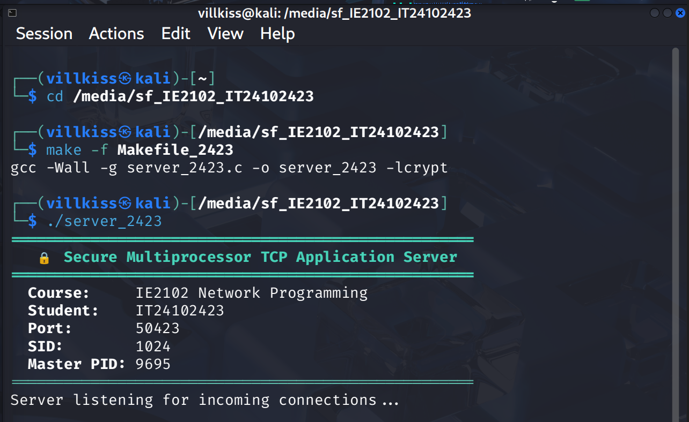
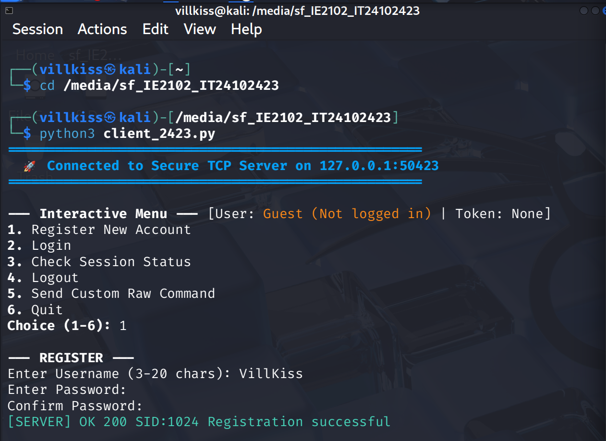
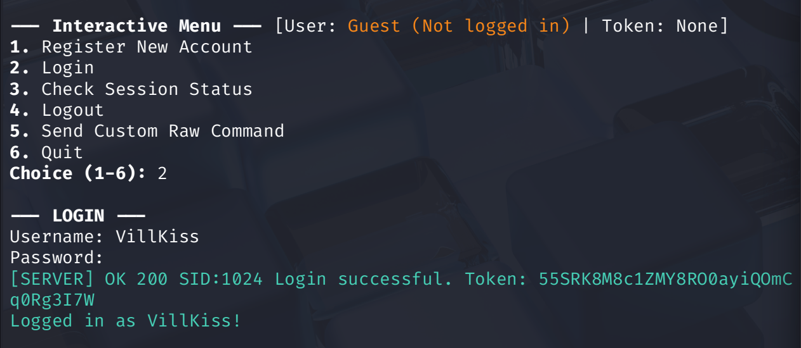

# 🔒 Secure Multiprocessor TCP Application Server


A high-performance, concurrent **TCP Application Server in C** designed for secure client authentication and session tracking. Built on a multi-process architecture using `fork()`, the server implements explicit length-prefixed protocol framing (`LEN:<size>\n<payload>`), salted **SHA-512** password cryptography, dynamic session token issuance, brute-force defense with account locking, per-connection rate limiting, and comprehensive audit trail logging.

Accompanied by an interactive, menu-driven **Python 3 Client** for seamless testing and demonstration.

---

## 📋 Table of Contents

- [Features](#-features)
- [Architecture & Concurrency](#-architecture--concurrency)
- [Tech Stack](#-tech-stack)
- [File Structure](#-file-structure)
- [Installation & Build](#-installation--build)
- [Usage Guide](#-usage-guide)
- [Protocol & Command Specification](#-protocol--command-specification)
- [Security Architecture & Threat Mitigation](#-security-architecture--threat-mitigation)
- [Audit Logging Format](#-audit-logging-format)
- [Screenshots & Verification](#-screenshots--verification)
- [Author](#-author)

---

## 🎯 Features

| Feature | Description |
| :--- | :--- |
| **Concurrent TCP Server** | High-throughput multi-client concurrency using POSIX `fork()` per connection. |
| **Custom Framing Protocol** | Robust `LEN:<byte_count>\n<payload>` framing prevents stream fragmentation & TCP sticking. |
| **Salted SHA-512 Hashing** | Cryptographically salted password hashing (`$6$` SHA-512) via `crypt()`; plaintext passwords are never stored. |
| **Session Token Management** | Secure 32-character random hexadecimal tokens issued upon login with automatic 5-minute inactivity expiry. |
| **Brute-Force Lockout** | Account lockout (`423 LOCKED`) triggered immediately after 3 consecutive failed login attempts. |
| **Rate Limiting** | Sliding window rate limiter enforcing a maximum of 10 requests per minute per connection (`429 ERR`). |
| **Zombie Process Reaper** | Asynchronous `SIGCHLD` signal handler with `waitpid(WNOHANG)` for zero process leaks. |
| **Audit Trail Logging** | Structured logging of timestamps, client IP/port, worker PID, user, command, and status to file and console. |
| **Interactive Client UI** | Colorful, menu-driven terminal interface with session state persistence and masked password inputs. |

---

## 🏗️ Architecture & Concurrency

```
+-------------------------------------------------------------------------+
|                        SERVER MASTER PROCESS (C)                        |
|                     Port: 50423 | Student: IT24102423                   |
|                                                                         |
|                          +------------------+                           |
|                          |   socket()       |                           |
|                          |   bind()         |                           |
|                          |   listen(10)     |                           |
|                          +--------+---------+                           |
|                                   |                                     |
|                       +-----------v----------+                          |
|                       |   accept() Listener  |                          |
|                       +-----------+----------+                          |
|                                   |                                     |
|           +-----------------------+-----------------------+             |
|           | fork()                | fork()                | fork()      |
|           v                       v                       v             |
|   +---------------+       +---------------+       +---------------+     |
|   | Child Worker 1|       | Child Worker 2|       | Child Worker N|     |
|   |  (PID: 10141) |       |  (PID: 10142) |       |  (PID: 1014N) |     |
|   +-------+-------+       +-------+-------+       +-------+-------+     |
+-----------|-----------------------|-----------------------|-------------+
            | TCP Socket            | TCP Socket            | TCP Socket
            | (Port 50423)          | (Port 50423)          | (Port 50423)
            v                       v                       v
    +---------------+       +---------------+       +---------------+
    | Client 1 (Py) |       | Client 2 (Py) |       | Client N (Py) |
    +---------------+       +---------------+       +---------------+
```

---

## 🛠️ Tech Stack

| Technology | Purpose |
| :--- | :--- |
| **C Language** | High-performance, low-level server socket implementation. |
| **Python 3** | Interactive terminal client application with color formatting. |
| **POSIX Sockets** | Reliable connection-oriented TCP socket networking (`sys/socket.h`). |
| **POSIX Multiprocessing** | `fork()` for independent worker process isolation. |
| **Signal Handling** | `SIGCHLD` and `waitpid()` for zombie process reclamation. |
| **libcrypt (`-lcrypt`)** | Unix crypt library utilizing `$6$` SHA-512 key derivation with random salt. |
| **Make / GCC** | Automated build compilation with standard compiler warnings (`-Wall -Wextra`). |

---

## 📁 File Structure

```
IE2102_IT24102423/
├── server_2423.c          # Core concurrent TCP server implementation in C
├── client_2423.py          # Interactive Python client application
├── Makefile                # Standard build automation script
├── Makefile_2423           # Assignment specific makefile
├── server_IT24102423.log   # Persistent server security and audit log file
├── .gitignore              # Git ignore rules for binaries and temporary files
├── Screenshots/            # Terminal demonstration captures
│   ├── Server.png
│   ├── Registration.png
│   ├── Login.png
│   ├── Failed Login.png
│   ├── Failed Login 2.png
│   ├── Account Lockout.png
│   ├── Multiple Client.png
│   ├── Zombie Process.png
│   └── Log file.png
└── data/                   # (Auto-created) Database directory storing credentials & locks
    ├── <username>.pass     # Salted SHA-512 password hashes
    ├── <username>.fail     # Failed login counter
    └── <username>.lock     # Account lock markers
```

---

## 🚀 Installation & Build

### Prerequisites

For Debian/Ubuntu/Kali Linux / WSL2:
```bash
sudo apt update
sudo apt install -y gcc make libcrypt-dev python3
```

### Build the Server

Compile the server executable using `make`:
```bash
make
```
*(Or compile manually with `gcc -Wall -O2 server_2423.c -o server_2423 -lcrypt`)*

---

## 💻 Usage Guide

### Step 1: Start the Server

Run the server executable on port **50423**:
```bash
make run
# or
./server_2423
```

**Expected Startup Banner:**
```
====================================================
   🔒 Secure Multiprocessor TCP Application Server  
====================================================
  Course:     IE2102 Network Programming
  Student:    IT24102423
  Port:       50423
  SID:        1024
  Master PID: 14014
====================================================
Server listening for incoming connections...
```

### Step 2: Launch the Client

In a separate terminal window, launch the interactive Python client:
```bash
python3 client_2423.py
```

**Interactive Menu:**
```
====================================================
  🚀 Connected to Secure TCP Server on 127.0.0.1:50423 
====================================================

--- Interactive Menu --- [User: Guest (Not logged in) | Token: None]
1. Register New Account
2. Login
3. Check Session Status
4. Logout
5. Send Custom Raw Command
6. Quit
Choice (1-6):
```

---

## 📡 Protocol & Command Specification

All client-server messages follow length-prefixed framing:
```
LEN:<byte_count>\n<payload>
```

### Supported Commands

| Command | Format | Description | Response Example |
| :--- | :--- | :--- | :--- |
| **REGISTER** | `REGISTER <user> <pass>` | Creates a new user with salted SHA-512 hash | `OK 200 SID:1024 Registration successful` |
| **LOGIN** | `LOGIN <user> <pass>` | Verifies credentials and generates session token | `OK 200 SID:1024 Login successful. Token: <token>` |
| **STATUS** | `STATUS` | Checks active login session | `OK 200 SID:1024 User: user1 (Active Session)` |
| **LOGOUT** | `LOGOUT [token]` | Invalidates session and clears active state | `OK 200 SID:1024 Logout successful` |

### Server Response Codes

| Status Code | Meaning | Cause |
| :--- | :--- | :--- |
| `200 OK` | Success | Operation completed successfully |
| `400 ERR` | Bad Request | Missing arguments or malformed framing header |
| `401 ERR` | Unauthorized | Incorrect password or unauthenticated request |
| `404 ERR` | Not Found | Unrecognized command |
| `409 ERR` | Conflict | Username already exists |
| `413 ERR` | Payload Too Large | Payload exceeds `MAX_PAYLOAD` (4096 bytes) |
| `423 ERR` | Locked | Account locked due to 3 consecutive failed logins |
| `429 ERR` | Rate Limit Exceeded | Client exceeded 10 requests / minute |

---

## 🛡️ Security Architecture & Threat Mitigation

### Password Hashing Pipeline

```
[User Password] ──┐
                  ├──> crypt(password, "$6$<salt>") ──> [Stored in .pass]
[16-Byte Salt]  ──┘       (SHA-512 5000 rounds)           "$6$f82a...$vK03..."
```

### Threat Mitigation Matrix

| Security Threat | Mitigation Strategy | Implementation Detail |
| :--- | :--- | :--- |
| **Rainbow Table Attacks** | Unique 16-character random cryptographic salt per user. | Utilizes `$6$` SHA-512 standard crypt hashing format. |
| **Credential Brute-Forcing** | Maximum 3 consecutive failed attempts before account lock. | Creates `.lock` barrier file for the account. |
| **Session Hijacking** | High-entropy 32-character hexadecimal session tokens. | Tokens expire automatically after 5 minutes of inactivity. |
| **Denial of Service (DoS)** | Per-connection sliding window rate limiter (10 req/min). | Drops connection and responds with `429 Rate Limit Exceeded`. |
| **Buffer Overflow Attacks** | Strict length checking (`MAX_PAYLOAD 4096`) and safe `memcpy`/`strncpy`. | Rejects oversized payloads with `413 Payload Too Large`. |
| **Zombie Process Leakage** | Non-blocking signal handler for child process exit. | `sigaction`/`signal(SIGCHLD)` running `waitpid(-1, NULL, WNOHANG)`. |

---

## 📜 Audit Logging Format

Every event is recorded with millisecond precision in `server_IT24102423.log`:

```
[YYYY-MM-DD HH:MM:SS] IP:<client_ip>:<port> PID:<worker_pid> User:<username> Cmd:<command> Result:<status>
```

---

## 📸 Screenshots & Verification

### 1. Server Startup on Port 50423


### 2. User Registration with SHA-512 Hashing


### 3. Login with 32-Character Session Token


### 4. Failed Login Attempts Tracking


### 5. Brute-Force Account Lockout (3rd Attempt)


### 6. Concurrent Multi-Client Handling via `fork()`
Verification showing isolated worker child processes spawned per client connection:


### 7. Zombie Process Prevention (`SIGCHLD` / `waitpid`)
Verification showing zero defunct or leaked zombie processes:


### 8. Server Security Audit Log File (`cat server_IT24102423.log`)


---

## ⭐ Show Your Support

Give this project a star ⭐ on GitHub if you found it useful or interesting!

---

## 📇 Contact & Profile

- **GitHub**: [@niduwara-j](https://github.com/niduwara-j)
- - **LinkedIn**: [Ninduwara Jayasiri]((https://www.linkedin.com/in/ninduwara-jayasiri-2169a33ab/))
- **Coursework**: IE2102 - Network Programming

---

<p align="center">
  Built with ❤️ and lots of C socket programming!
</p>
